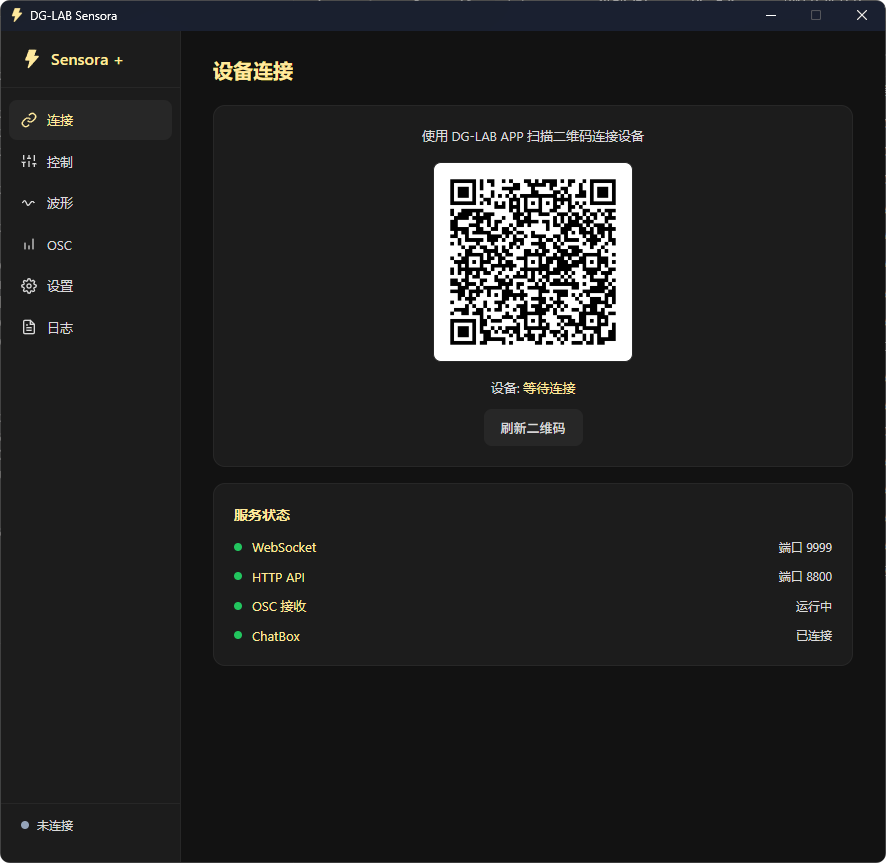
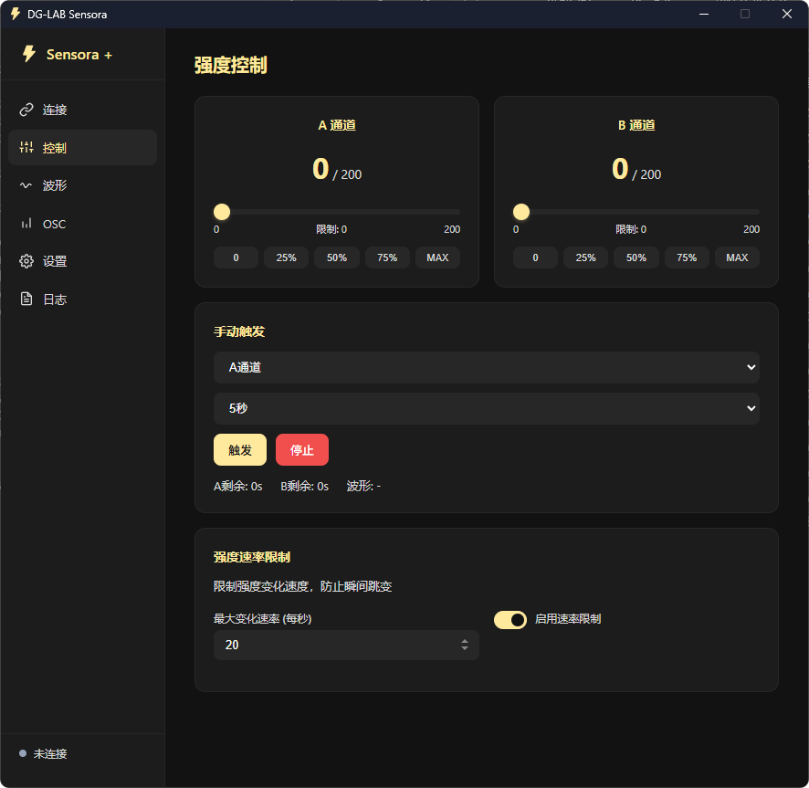

# DG-LAB Sensora+

DG-LAB 设备的 VRChat 联动工具，支持通过 OSC Avatar 参数和 HTTP API 控制 DG-LAB 郊狼设备。  
兼容 “芝士郊狼台球后援会” 相关地图。

  

## 功能

- 通过 WebSocket 连接 DG-LAB APP（扫码配对）
- VRChat OSC Avatar 参数接收，支持距离/电击/触摸三种模式
- VRChat Chatbox 状态输出，支持自定义模板
- HTTP API 供 VRChat 地图或第三方程序调用
- 16 个内置波形预设，支持按秒数随机选取
- A/B 通道独立强度控制，滑块上限跟随设备限制
- 强度变化速率限制，防止瞬间跳变
- 实时波形监视器
- 运行日志查看/筛选/复制

## 运行

### 从源码运行

```bash
pip install -r requirements.txt
python main.py
```

### 从打包版运行

双击 `DG-LAB-Sensora.exe` 即可，配置文件 `settings.json` 会自动生成在 exe 同目录。

## 打包

```bash
build.bat
```

需要安装 Nuitka：`pip install nuitka ordered-set zstandard`

## HTTP API

基础地址: `http://127.0.0.1:8800`

### 获取状态

```
GET /api/v1/status
```

响应:
```json
{
  "healthy": "ok",
  "devices": [{
    "type": "shock",
    "device": "coyotev3",
    "attr": {
      "strength": { "A": 50, "B": 30 },
      "uuid": "dglab-coyote"
    }
  }]
}
```

### 触发电击（路径格式）

```
GET /api/v1/shock/{channel}/{seconds}
```

参数:
- `channel`: `A` / `B` / `all`
- `seconds`: 1-10

示例:
```
GET /api/v1/shock/all/3
GET /api/v1/shock/A/5
```

### 触发电击（查询参数格式）

```
GET /?shock={channel}&seconds={n}
```

示例:
```
GET /?shock=A&seconds=5
GET /?shock=all&seconds=3
```

### 发送波形（路径格式）

```
GET /api/v1/sendwave/{channel}/{hex_data}?repeat={n}
```

参数:
- `channel`: `A` / `B`
- `hex_data`: 16字符 HEX 波形数据
- `repeat`: 重复次数（可选，默认1）

### 发送波形（查询参数格式）

```
GET /?sendwave={channel}&data={hex}&repeat={n}
```

## OSC 参数

### Avatar 通道模式

每个通道支持多个参数条目，每条可独立配置：

| 字段 | 说明 |
|------|------|
| path | OSC 参数路径，支持通配符 `*` |
| type | `float` 或 `bool` |
| mode | `distance` / `shock` / `touch` |
| trigger_range | 触发范围 [min, max] |

#### 距离模式 (distance)

参数值在 trigger_range 范围内时，按比例映射为波形强度，实时持续输出。

#### 电击模式 (shock)

参数值超过 trigger_range[0] 时触发一次电击，之后进入 1 秒冷却。

#### 触摸模式 (touch)

根据参数值的变化速度（一阶导数）映射强度，变化越快强度越高。

#### 布尔类型 (bool)

- trigger_range[0] = 1: 参数为 true 时触发
- trigger_range[0] = 0: 参数为 false 时触发

## 依赖

| 包 | 版本 | 用途 |
|----|------|------|
| pywebview | >=5.0 | 桌面窗口 |
| websockets | >=12.0 | DG-LAB 通信 |
| aiohttp | >=3.9 | HTTP API 服务器 |
| python-osc | >=1.8 | OSC 收发 |
| qrcode | >=7.4 | 二维码生成 |
| Pillow | >=10.0 | 图像处理 |
| pydglab-ws | - | DG-LAB WebSocket 协议库 |

## 项目结构

```
DG-LAB-Sensora/
├── main.py              # 入口
├── app.py               # 核心控制器
├── ws_server.py         # WebSocket 服务器
├── osc_handler.py       # OSC 处理
├── http_server.py       # HTTP API
├── waveform.py          # 波形生成
├── waveform_library.py  # 波形预设库
├── settings.py          # 设置管理
├── constants.py         # 常量
├── requirements.txt     # 依赖
├── build.bat            # 打包脚本
└── web/                 # 前端界面
    ├── index.html
    ├── style.css
    ├── app.js
    └── images/
        └── logo.svg
```
